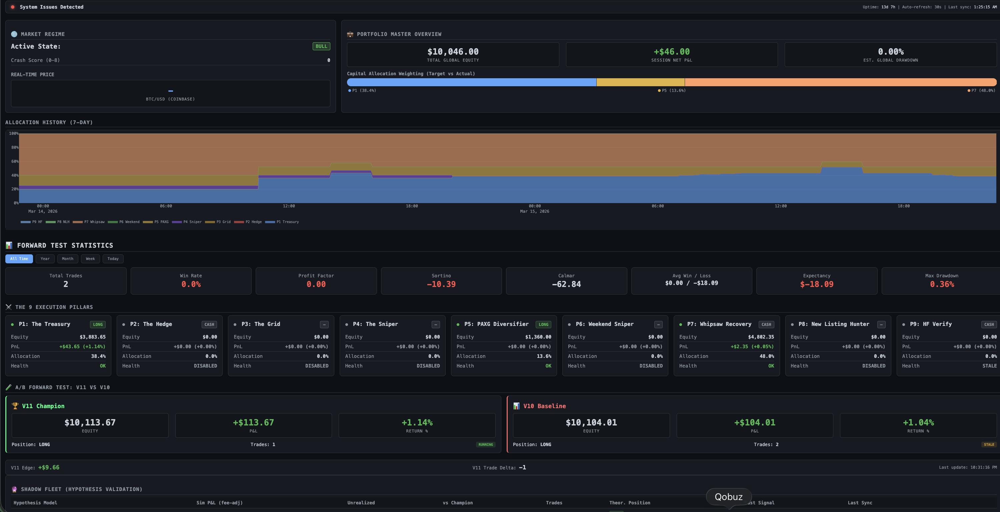
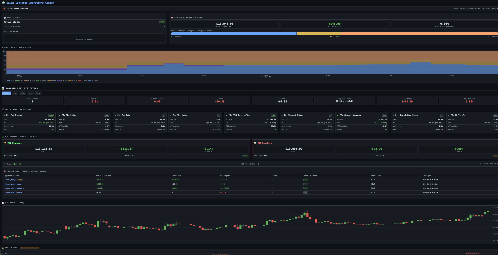
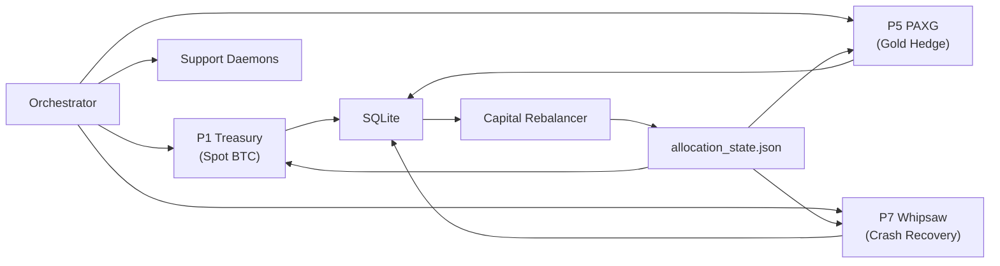
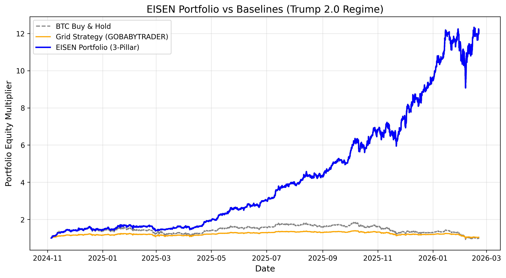

```
    ███████╗██╗███████╗███████╗███╗   ██╗
    ██╔════╝██║██╔════╝██╔════╝████╗  ██║
    █████╗  ██║███████╗█████╗  ██╔██╗ ██║
    ██╔══╝  ██║╚════██║██╔══╝  ██║╚██╗██║
    ███████╗██║███████║███████╗██║ ╚████║
    ╚══════╝╚═╝╚══════╝╚══════╝╚═╝  ╚═══╝
```

# EISEN — Multi-Pillar Algorithmic Trading System

A production BTC-USD trading system built on Clean Architecture (Ports & Adapters),
live on Coinbase since 2025. Multi-strategy portfolio with dynamic regime-conditional
capital allocation across 3 active pillars.

**This is the public portfolio companion to a private production codebase.**
Architecture decisions, engineering methodology, and research frameworks are shown here.
Strategy parameters, signal logic, and backtest results remain private.

Solo-engineered over 18 months. 398 controlled experiments. 277 hypotheses.
104 documented dead ends. 128 test modules.

---

## What This Project Is

EISEN is a fully automated algorithmic trading system managing a multi-strategy
BTC-USD portfolio. It runs independent strategy engines ("pillars") concurrently,
with a dynamic capital allocator that shifts weights based on detected market regime.

I built 9 strategy pillars. I systematically eliminated 6 of them with evidence.
The survivors form a 3-pillar portfolio.

The trading system itself is only half the artifact. The other half is the
**research methodology** — a system that treats every parameter change as a
scientific experiment, every backtest as a falsifiable hypothesis, and every
failure as permanent institutional knowledge.

---

## Dashboard





*Custom Flask dashboard (~3,000 lines). Portfolio equity, regime detection,
per-pillar health, allocation history, equity curves, trade logs. Deployed on
VPS behind SSH tunnel with automated staleness kill switches.*

---

## Architecture

Clean Architecture with strict boundary enforcement. Trading logic never imports
concrete exchange code.

```
src/
├── domain/          # Pure Python models (Candle, OrderRequest, Signal)
├── ports/           # Abstract interfaces (ExecutionPort, MarketDataPort)
├── adapters/        # Exchange connectors (Coinbase REST/WS, CSV, SQLite)
├── services/        # Strategy engine, risk guards, regime detection
│   ├── adaptive_strategy_router.py    # Core router (~3,500 lines)
│   ├── router/                        # Extracted pure-function modules (14 files)
│   │   ├── bear_detection.py
│   │   ├── crash_score.py             # 8-signal composite
│   │   ├── regime_ensemble.py         # Lead-lag + BOCPD
│   │   ├── predictive_hold.py
│   │   ├── signal_generation.py
│   │   ├── triple_barrier_gate.py     # ML sell-veto (HistGBT)
│   │   ├── portfolio_allocator.py     # CVaR-interpolated regime allocation
│   │   └── ...
│   └── indicators/
│       └── technical_indicators.py    # Wilder-smoothed RSI/ATR, incremental Bollinger
├── backtesting/     # Walk-forward harness, BacktestEngine, Pareto search
└── config.py        # Pydantic-validated settings
```

The port/adapter pattern means I can swap Coinbase for Binance, replace SQLite
with Postgres, or run the entire system in backtest mode — without changing a
single line of strategy logic.

See [architecture/port_interfaces.md](architecture/port_interfaces.md) for the
actual ABC definitions and [architecture/domain_models.md](architecture/domain_models.md)
for the pure domain layer.

### Multi-Pillar Portfolio



Each pillar is an independent process. One crash doesn't take down the portfolio.
Capital shifts between pillars based on market regime using CVaR-interpolated
weights with CHOP index shifting. If a required pillar crashes unrecoverably,
the entire system halts.

Full topology: [architecture/system_design.md](architecture/system_design.md)

### Versioning

4-namespace system to prevent conflating component changes with system-level changes:

| Namespace | Format | Example |
|-----------|--------|---------|
| System | `EISEN S{N}` | `EISEN S7` — full multi-pillar + allocator snapshot |
| Pillar | `P{N}-{Name}.v{M}` | `P1-Spot.v11` — individual pillar config |
| Allocator | `Alloc.v{M}` | `Alloc.v22` — allocation logic |
| Deployment | `D{N}` | `D28` — VPS ops patch |

"Compare V10 to V11" is an anti-pattern — always specify scope.

---

## Subtractive Design

Most trading systems are built additively. EISEN does the opposite.

| Pillar | Strategy | Status | Evidence |
|--------|----------|--------|----------|
| P1 Treasury | Adaptive spot BTC, predictive hold/exit | Active | V11 champion, Sortino 2.74 |
| P5 PAXG | Gold-backed crypto, regime diversification | Active | Uncorrelated to BTC drawdowns |
| P7 Whipsaw | Crash recovery, staged re-entry | Active | Best worst-case Sortino (-0.26) |
| P2 Hedge | Futures-hedged spot | Killed | -$183 cumulative, crash-loop instability |
| P3 Grid | Market-making grid | Killed | -$4,447/4yr, fee drag without maker rebates |
| P4 Multi-Token | Momentum alt rotation | Killed | -38.85% forward test, 80%+ backtest DD |
| P6 Weekend | Mean-reversion, low-volume | Killed | Regime selection bias, not alpha |
| P8 NLH | New listing hunter | Killed | 154 crash-loop exits/day |
| P9 HF Verify | HF signal verification | Killed | Zero gradient on all parameters |

Every elimination is backed by a controlled test ID and P&L evidence.

---

## Things That Don't Work

After 398 controlled tests, several counterintuitive results:

**Static thresholds beat every adaptive mechanism (0/9).** Nine attempts at
dynamic thresholds — regime-conditional, vol-scaled, EMA-adaptive, ML-predicted —
all performed worse than a fixed lookup table. In a noisy non-stationary
environment, estimating the "correct" threshold in real-time introduces more
error than it removes.

**Cooldowns are load-bearing.** Removing cooldown periods spikes drawdown from
27% to 77%+. They aren't hesitation — they're structural protection against
whipsaw sequences.

**Complexity destroys.** Dynamic sizing, regime-conditional exits, drawdown
circuit breakers, vol-target sizing — all either zero effect or destructive.
Winning config: 14 parameters. Early versions: 40+.

**The Chop Problem (2025+).** Post-Jan 2025 BTC quadrupled the Choppiness Index.
All EMA trend-following suffered massive whipsaw losses. Solution: a CHOP < 61.8
entry gate. Not parameter optimization — a market microstructure discovery that
forced architectural change.

**Temporal microstructure > indicators.** EU Open (09:00-11:00 UTC) is
trend-dominant but violently noisy at short timeframes. Weekends are the only
safe mean-reversion window. These are structural features of BTC, not tunable
parameters.

---

## Research Methodology

### Hypothesis-Driven Development

Every change starts as a numbered hypothesis (H1-H307+):

```
PROPOSED -> ACTIVE -> {VALIDATED | REJECTED | DEAD_END}
```

Acceptance requires a falsifiable prediction, a controlled test with locked
evaluation contract, out-of-sample validation, and evidence of no degradation
to other pillars.

### Tiered Testing

For sweeps >5 configs, a phased protocol eliminates duds early:

| Phase | What | Time/Config | Kill Rate |
|-------|------|-------------|-----------|
| Quick Kill | Hardest regime only | ~3 min | ~80% |
| Validation | 3-window eval | ~10 min | ~15% |
| Walk-Forward OOS | 6 yearly windows | ~25 min | Final gate |

20-config sweep: ~25 min instead of ~7 hours.

Full framework: [methodology/parameter_testing.md](methodology/parameter_testing.md)

### Overfitting Detection

- Probability of Backtest Overfitting (PBO) — combinatorial symmetric cross-validation
- Deflated Sharpe Ratio — adjusts for multiple testing
- IS-to-OOS decay tracking — flags performance degradation

### Adversarial Red-Teaming

Every hypothesis is stress-tested:

1. Is the signal forward-biased? Can it execute on the next bar?
2. Does it survive hostile regimes? (2022 bear, not just 2023 bull)
3. Can the mechanism be explained? If not, it's curve-fitting.
4. Pluribus test — does it survive if everyone runs it?

Framework: [methodology/adversarial_reasoning.md](methodology/adversarial_reasoning.md)

---

## AI-Assisted Development

EISEN is built with a structured multi-agent AI harness. Different personas
activate for different tasks:

| Persona | Role |
|---------|------|
| Orchestrator | Architecture, task management |
| Researcher | Experiment design, statistical validity |
| Executor | Implementation, minimal side effects |
| Validator | OOS proof demands, performance challenges |
| Adversary | Red-teaming, overfitting detection |
| Entropy Architect | Fragility analysis, regime assumptions |

Each persona has different acceptance criteria. The Adversary rejects hypotheses
the Researcher proposed. The Validator demands evidence the Executor didn't
generate. Structured disagreement catches errors that single-perspective
workflows miss.

14 automated post-edit hooks fire on every code change. 21 reusable skill
workflows handle common operations (frequency audits, config testing,
architecture verification).

Protocol: [engineering/agent_coordination.md](engineering/agent_coordination.md)

---

## Structural Limits

Constraints that cannot be fixed without fundamental architecture changes:

- **Long-only**: Cannot profit in 2022-type bear markets
- **Max DD floor ~27.55%**: Hard limit without shorting capability
- **Parameter space deeply explored**: 398+ CTs, diminishing returns
- **Static threshold ceiling**: 0/9 dynamic variants improved on static
- **Fee asymmetry kills grid strategies**: Coinbase maker/taker spread

These define the domain of the system, not its defects.

---

## Stack

| Component | Technology |
|-----------|-----------|
| Language | Python 3.11+ |
| Exchange | Coinbase Advanced Trade (REST + WebSocket) |
| Database | SQLite |
| Config | Pydantic + JSON presets |
| Data | 6 APIs, 25 features/cycle |
| ML | HistGBT triple-barrier classifier |
| WebSockets | L2 orderbook, strict TLS (certifi) |
| Backtesting | Walk-forward, Pareto search, PBO detection |
| Deployment | VPS, NSSM services |
| Monitoring | Flask dashboard + Discord alerts |
| Quality | ruff, mypy, pytest (128 modules) |

---

## This Repository

```
eisen-portfolio/
├── README.md
├── docs/
│   ├── eisen_portfolio_benchmark.png
│   ├── dashboard_upper.png
│   ├── dashboard_full.png
│   └── dashboard_preview.png
├── architecture/
│   ├── port_interfaces.md             # Clean Architecture ABCs
│   ├── domain_models.md               # Pydantic data contracts
│   └── system_design.md               # Multi-pillar topology
├── methodology/
│   ├── parameter_testing.md           # 6-gate hypothesis validation
│   └── adversarial_reasoning.md       # Game-theoretic signal evaluation
└── engineering/
    ├── engineering_standards.md        # Code style, anti-patterns
    ├── validation_matrix.md           # What to validate and when
    ├── agent_coordination.md          # Multi-persona AI development
    └── capital_event_tracking.md      # Deposit-aware equity tracking
```

The full production codebase (137 scripts, 128 test modules, 21 skill workflows,
50+ forensics reports) is in a private repository.

---

## Performance Context

All figures are from backtested simulations using walk-forward out-of-sample
validation. Past performance does not guarantee future results. The system
is structurally long-only and cannot profit during prolonged bear markets.



V11 Champion (P1-Spot.v11), full 4-year backtest (2022-2025):

| Metric | Value |
|--------|-------|
| Sortino (gamma=2) | 2.736 |
| Calmar | 1.661 |
| Max Drawdown | 27.55% |
| Total Trades | 87 (~2/month) |

Why Sortino over Sharpe: Sharpe penalizes all volatility equally. In crypto,
upside moves are structurally larger than downside. Penalizing a +15% day the
same as a -15% day is incorrect for right-skewed distributions.

---

## About

Built by [Raymond de Oliveira](https://github.com/raydeoliveira).

18+ months of continuous development — designing, building, testing, and
operating a production trading system from first principles. The methodology
(hypothesis-driven development, tiered testing, adversarial red-teaming,
systematic dead-end tracking) transfers to any domain where decisions must
be evidence-based and failures must be documented.
