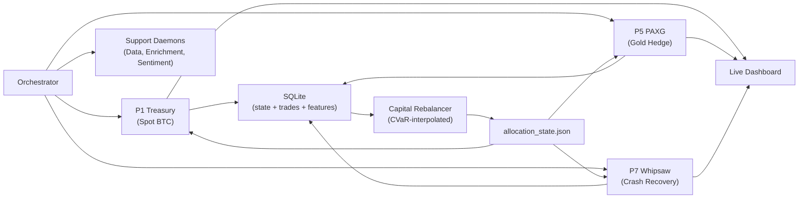

<p align="center">
  <h1 align="center">EISEN</h1>
  <p align="center">
    <strong>A Multi-Pillar Algorithmic Trading System for BTC-USD</strong><br/>
    <em>Solo-engineered over 18 months. 398 controlled experiments. 277 hypotheses. 104 documented dead ends.</em>
  </p>
  <p align="center">
    
    
    
    
  </p>
</p>

> **This is the public portfolio companion to a private production codebase.** It showcases architecture decisions, engineering methodology, research frameworks, and design philosophy — not trading strategies or signal logic.

---

## About This Project

EISEN is a fully automated BTC-USD trading system that runs a **multi-pillar portfolio** — independent strategy engines operating concurrently with dynamic, regime-conditional capital allocation. It has been live-trading on Coinbase since 2025.

But the trading system itself is only half the story. The real artifact is the **engineering methodology**: a system that treats every parameter change as a scientific experiment, every backtest as a falsifiable hypothesis, and every failure as permanent institutional knowledge.

I built 9 strategy pillars. I kept 3. The other 6 were eliminated with evidence.

**What this portfolio demonstrates:**
- Clean Architecture in a safety-critical domain (real money, real risk)
- Hypothesis-driven development with 398+ controlled experiments
- Multi-agent AI coordination for research, implementation, validation, and adversarial review
- Systematic knowledge management — documenting *what fails* as rigorously as *what works*
- Production operations (VPS deployment, live monitoring, automated health checks)

---

## Performance Context

> **Disclaimer**: All figures are from *backtested simulations* using walk-forward out-of-sample validation. Past performance does not guarantee future results. The system is structurally long-only and cannot profit during prolonged bear markets.

<p align="center">
  
</p>

The chart benchmarks the EISEN 3-pillar portfolio against BTC buy-and-hold and a commercial grid-trading bot across the Trump 2.0 regime (Oct 2024 – Mar 2026).

**V11 Champion (P1-Spot.v11) — Full 4-year backtest (2022–2025):**

| Metric | Value | Why This Metric |
|--------|-------|----------------|
| Sortino (γ=2) | **2.736** | Penalizes only downside vol — crypto is right-skewed, upside vol is *desirable* |
| Calmar | **1.661** | Return per unit of max drawdown |
| Max Drawdown | **27.55%** | Hard floor for a long-only system |
| Total Trades | **87** | ~2/month — high conviction, low turnover |

**Why not Sharpe?** Sharpe penalizes all volatility equally. In crypto, upside moves are structurally larger than downside moves. Penalizing a +15% day the same as a -15% day is mathematically incorrect for right-skewed distributions. Sortino(γ=2) rewards the asymmetry that makes crypto attractive. This is one of many domain-specific insights documented in the [Optimization Framework](methodology/parameter_testing.md).

---

## Architecture

EISEN follows **Clean Architecture** (Ports & Adapters) with strict boundary enforcement — trading logic never imports concrete exchange code:

```
src/
├── domain/          # Pure Python models (Candle, OrderRequest, Signal)
├── ports/           # Abstract interfaces (ExecutionPort, MarketDataPort)
├── adapters/        # Exchange connectors (Coinbase REST/WS, CSV, SQLite)
├── services/        # Strategy engine, risk guards, regime detection
│   ├── adaptive_strategy_router.py    # Core router (~3,500 lines)
│   ├── router/                        # Extracted pure-function modules (14 files)
│   │   ├── bear_detection.py          # Multi-signal bear market detection
│   │   ├── crash_score.py             # 8-signal composite crash scorer
│   │   ├── regime_ensemble.py         # Lead-lag + BOCPD regime detection
│   │   ├── predictive_hold.py         # Predictive exit timing engine
│   │   ├── signal_generation.py       # Signal generation pipeline
│   │   ├── triple_barrier_gate.py     # ML sell-veto gate (HistGBT classifier)
│   │   └── ...
│   └── indicators/
│       └── technical_indicators.py    # Wilder-smoothed RSI/ATR, incremental Bollinger
├── agents/          # AI agent wrappers (sentiment, analyst)
├── backtesting/     # Walk-forward harness, BacktestEngine
└── config.py        # Pydantic-validated settings
```

### Why Clean Architecture for Trading?

In a system where a misrouted order can lose real money, **boundary enforcement isn't academic — it's risk management.** The port/adapter pattern gives us:

1. **Adapter swappability**: Switch between paper trading, backtesting, and live execution by swapping a single adapter — zero strategy code changes
2. **Testability**: The entire strategy engine can be tested against mock adapters with deterministic market data
3. **Risk isolation**: A bug in the Coinbase WebSocket adapter cannot corrupt the strategy state machine

See the full [port interface definitions](architecture/port_interfaces.md) and [domain model contracts](architecture/domain_models.md) for the concrete ABCs.

### Multi-Pillar Portfolio System

Rather than a single monolithic strategy, EISEN runs independent strategy pillars orchestrated by a dynamic capital allocator:



Capital allocation is **dynamic and regime-conditional**: the allocator uses CVaR-interpolated weights with CHOP index shifting. Each pillar operates independently with its own position state, risk guards, and failure policy. The orchestrator enforces lockstep — if a required pillar crashes unrecoverably, the entire system halts.

### Versioning Taxonomy

EISEN uses a **4-namespace versioning system** to prevent conflating component changes with system-level changes:

| Namespace | Format | Example | Meaning |
|-----------|--------|---------|---------|
| **System** | `EISEN S{N}` | `EISEN S7` | Full multi-pillar + allocator snapshot |
| **Pillar** | `P{N}-{Name}.v{M}` | `P1-Spot.v11` | Individual pillar config version |
| **Allocator** | `Alloc.v{M}` | `Alloc.v22` | Portfolio allocation logic version |
| **Deployment** | `D{N}` | `D28` | VPS deployment patch (ops, not strategy) |

"Compare V10 to V11" is an **anti-pattern** — it's ambiguous whether it refers to a pillar config or the entire system. The taxonomy forces precision: `P1-Spot.v10` vs `P1-Spot.v11` (pillar scope) or `EISEN S6` vs `EISEN S7` (system scope).

---

## Live Operations Dashboard

<p align="center">
  
</p>

<p align="center">
  
</p>

> *Screenshots are illustrative and may not reflect current system state.*

A custom Flask dashboard (~3,000 lines of Python + hand-written HTML/CSS/JS) serves as the operations center:

- **Portfolio overview** — global equity, session P&L, estimated drawdown, capital allocation waterfall
- **Market regime detection** — BULL/BEAR/NEUTRAL with 8-signal composite crash score
- **Pillar health cards** — per-pillar equity, allocation %, position state, heartbeat status
- **A/B forward testing** — side-by-side champion vs baseline with live edge tracking
- **Shadow fleet** — candidate strategies running in parallel for hypothesis validation
- **7-day allocation history** — regime-driven capital shifts over time
- **Equity curve** — live data with optional backtest warmup overlay
- **Automated health checks** — data freshness, staleness kill switches, crash-loop detection

---

## The Subtractive Design Philosophy

Most trading systems are built additively — keep adding indicators and complexity until the backtest looks good. EISEN does the opposite.

I built 9 independent strategy pillars. Then I systematically tested each one against hostile market regimes, fee structures, and portfolio interactions. **Six didn't survive:**

| Pillar | Strategy | Verdict | Key Evidence |
|--------|----------|---------|-------------|
| **P1 Treasury** | Adaptive spot BTC with predictive hold/exit | ✅ Active | V11 champion, Sortino 2.74 |
| **P5 PAXG** | Gold-backed crypto for regime diversification | ✅ Active | Uncorrelated to BTC drawdowns |
| **P7 Whipsaw** | Crash recovery with staged re-entry | ✅ Active | Best worst-case Sortino (-0.26) |
| P2 Hedge | Futures-hedged spot positions | ❌ Eliminated | -$183 cumulative, crash-loop instability |
| P3 Grid | Market-making grid strategy | ❌ Eliminated | -$4,447/4yr — fee drag with no maker rebates |
| P4 Multi-Token | Momentum alt-coin rotation | ❌ Eliminated | -38.85% forward test, 80%+ backtest DD |
| P6 Weekend | Mean-reversion on low-volume | ❌ Eliminated | Regime selection bias, not alpha |
| P8 NLH | New listing hunter | ❌ Eliminated | 154 crash-loop exits/day on VPS |
| P9 HF Verify | High-frequency signal verification | ❌ Eliminated | Zero gradient on all parameters |

Every elimination is backed by controlled test IDs, P&L evidence, and a specific rule that killed it.

---

## Things That Should Work But Don't

The most valuable output of this project isn't the trading system — it's the **knowledge of what fails and why**. After 398 controlled tests, several counterintuitive patterns emerged:

### Static thresholds beat every adaptive mechanism (0/9 success rate)

Nine different attempts to make thresholds dynamic — regime-conditional, volatility-scaled, EMA-adaptive, ML-predicted — all performed worse than a fixed lookup table. In a noisy, non-stationary environment like BTC, the overhead of estimating the "correct" threshold in real-time introduces more error than it removes. A well-chosen static threshold learned from out-of-sample data is more robust than any dynamic mechanism tested.

### Cooldowns are load-bearing infrastructure

Removing or reducing cooldown periods causes drawdown to spike from 27.55% to 77%+. Cooldowns aren't conservative hesitation — they're structural protection against whipsaw sequences.

### Complexity is the enemy

Every attempt to add sophistication — dynamic position sizing, regime-conditional exits, monthly drawdown circuit breakers, vol-target sizing — either had zero effect or was actively destructive. The winning configuration uses 14 parameters. Early versions had 40+.

### The Chop Problem (2025+)

The post-January 2025 BTC regime quadrupled the daily Choppiness Index. All EMA trend-following strategies suffered massive whipsaw losses. EISEN's solution: a `CHOP < 61.8` entry gate that refuses to enter during choppy regimes. This wasn't a parameter optimization — it was a **market microstructure discovery** that forced architectural change.

### Temporal microstructure matters more than indicators

The EU Open (09:00–11:00 UTC) is trend-dominant but violently noisy at short timeframes. Weekend markets are the only safe window for mean-reversion. These aren't tunable parameters — they're structural features of BTC market microstructure. See the [Adversarial Reasoning Framework](methodology/adversarial_reasoning.md) for the game-theoretic evaluation approach.

---

## Research Methodology

### Hypothesis-Driven Development

Every strategy change begins as a numbered hypothesis (H1–H307+) with a lifecycle:

```
PROPOSED → ACTIVE → {VALIDATED | REJECTED | DEAD_END}
```

Accepted hypotheses require:
- A **falsifiable prediction** with pre-specified evaluation metrics
- A **controlled test** (CT-xxx) with a locked evaluation contract
- **Out-of-sample validation** on unseen data
- Evidence of **no degradation** to other pillars

### Tiered Testing Protocol

For parameter sweeps (>5 configs), a mandatory phased protocol eliminates bad candidates early:

| Phase | Windows | Time/Config | Kill Threshold | Typical Elimination |
|-------|---------|-------------|----------------|---------------------|
| **1: Quick Kill** | 1 (hardest regime) | ~3 min | Baseline -5pp | 80% eliminated |
| **2: Validation** | 3 (Bear, Bear, Full) | ~10 min | Champion -10 | 15% eliminated |
| **3: Walk-Forward OOS** | 6 (yearly 2020–2025) | ~25 min | Forward degradation >-5pp | Final survivors |

This reduces a 20-config sweep from ~7 hours to ~25 minutes. See the full [Parameter Testing Framework](methodology/parameter_testing.md).

### Overfitting Detection

The #1 failure mode in quantitative trading is optimizing on noise. EISEN uses three automated safeguards:

- **Probability of Backtest Overfitting (PBO)** — combinatorial symmetric cross-validation
- **Deflated Sharpe Ratio** — adjusts for multiple testing and non-normal returns
- **IS→OOS decay tracking** — automatic flagging when in-sample to out-of-sample performance degrades

### Adversarial Red-Teaming

Every hypothesis is stress-tested with a structured [adversarial framework](methodology/adversarial_reasoning.md):

1. **Is the signal forward-biased?** — Can it actually be executed on the next bar?
2. **Does it survive hostile regimes?** — Test on 2022 bear, not just 2023 bull
3. **Can the mechanism be explained?** — If not, it's curve-fitting, not alpha
4. **What's the Pluribus test?** — Would this strategy still work if everyone ran it?

---

## AI-Assisted Development (Agentic Harness)

EISEN is developed with a structured **agentic AI harness** — a multi-persona coordination framework that enforces engineering discipline through role separation, automated hooks, and reusable skill workflows.

### Multi-Persona Agent Team

Different AI personas are activated for different tasks, each with a distinct directive:

| Persona | Role | Focus |
|---------|------|-------|
| **Orchestrator** | Task management, architecture | System dependencies, workflow execution |
| **Researcher** | Quantitative analysis | Statistical validity, experiment design |
| **Executor** | Implementation | Safe code changes, minimal side effects |
| **Validator** | Quality assurance | OOS proof demands, performance challenges |
| **Adversary** | Red-teaming | Overfitting detection, logical traps |
| **Entropy Architect** | Fragility analysis | Regime assumptions, structural weakness |
| **Social Analyst** | Sentiment evaluation | Narrative traps, manufactured consensus |

This isn't role-play — each persona has **different acceptance criteria**. The Adversary will reject a hypothesis the Researcher proposed. The Validator demands evidence the Executor didn't generate. This structured disagreement catches errors that a single-perspective workflow would miss. See the full [Agent Coordination Protocol](engineering/agent_coordination.md).

### Automated Hooks (14 post-edit triggers)

Every code change auto-fires validation hooks before results are reported:

| Hook | Trigger | What It Does |
|------|---------|-------------|
| `post-code-edit` | Any `src/**/*.py` change | Lint + type-check + import validation |
| `post-config-change` | Any `config/*.json` change | Pillar integrity + architecture consistency |
| `time-window-hygiene` | Before any backtest | Blocks tests with >90% information loss |
| `pillar-lockstep` | Deploy or verify | Validates all required pillars exist and are wired |
| `post-router-refactor` | Router changes | Full integration test suite (30–90s) |

### Skills System (21 reusable workflows)

```
/frequency-audit         — Temporal hygiene validation
/config-test             — Full A/B/C/D parameter test with OOS
/adversarial-signal-audit — Signal robustness evaluation
/architecture-verify     — Pillar integrity validation
/risk-controls-audit     — Risk guardrail audit
```

---

## Structural Limits (Honest Assessment)

These are constraints that cannot be fixed without fundamental architecture changes:

- **Long-only**: Cannot profit in 2022-type bear markets (would require shorts/derivatives)
- **Max DD floor ~27.55%**: Hard to improve further without shorting capability
- **Parameter space deeply explored**: 398+ CTs suggest diminishing returns
- **Static threshold ceiling**: All 9 dynamic variants were worse; unlikely to improve
- **Fee asymmetry kills grid strategies**: Maker/taker spread eliminates market-making approaches

These limits are not bugs — they define the **domain** of the system. Understanding what a system *cannot* do is as important as understanding what it can.

---

## Engineering Approach

### Key Principles

- **Ports & Adapters**: Trading logic never imports concrete exchange code — strict boundary enforcement
- **Temporal Hygiene**: Feature cadence vs decision cadence must be verified before any experiment
- **No Orphan Scripts**: Every script is registered; one-off scripts go to `_archive/`
- **Single Source of Truth**: One canonical store for hypotheses, one for experiment results, one for architecture
- **Anti-Pattern Registry**: Known anti-patterns (ring buffer `list.pop(0)`, naive `datetime.now()`, missing `is not None` guards) are documented and blocked

### Validation Philosophy

See the full [Validation Matrix](engineering/validation_matrix.md) and [Engineering Standards](engineering/engineering_standards.md) for:
- When to run which validation command
- Temporal hygiene checklists (frequency alignment, look-ahead prevention)
- Feature enablement protocol
- The 6-gate sequential acceptance framework

### Technical Stack

| Component | Technology |
|-----------|-----------|
| Language | Python 3.11+ |
| Exchange | Coinbase Advanced Trade (REST + WebSocket) |
| Database | SQLite (market data, trades, features, allocation state) |
| Configuration | Pydantic + JSON config presets |
| Data Enrichment | 6 APIs, 25 features/cycle (funding, OI, sentiment, macro) |
| ML Models | HistGBT triple-barrier classifier (sell-veto gate) |
| WebSockets | Real-time L2 orderbook + trade flow with strict TLS |
| Backtesting | Custom engine: walk-forward, Pareto search, PBO detection |
| Deployment | VPS (Windows Server) with NSSM service management |
| Monitoring | Custom Flask dashboard + Discord webhook alerts |
| Code Quality | ruff, mypy, pytest (128 test modules) |

---

## Repository Structure (This Portfolio)

```
├── README.md                          # This file
├── docs/                              # Dashboard screenshots and benchmarks
│   ├── eisen_portfolio_benchmark.png
│   ├── dashboard_upper.png
│   ├── dashboard_full.png
│   └── dashboard_preview.png
├── architecture/                      # Design decisions and contracts
│   ├── port_interfaces.md             # Clean Architecture ABCs
│   ├── domain_models.md               # Pydantic data contracts
│   └── system_design.md               # Multi-pillar topology and versioning
├── methodology/                       # Research and testing frameworks
│   ├── parameter_testing.md           # 6-gate hypothesis validation
│   └── adversarial_reasoning.md       # Game-theoretic signal evaluation
└── engineering/                       # Standards and processes
    ├── engineering_standards.md        # Code style, anti-patterns, guardrails
    ├── validation_matrix.md           # What to validate and when
    ├── agent_coordination.md          # Multi-persona AI development harness
    └── capital_event_tracking.md      # Deposit-aware equity tracking design
```

> The full production codebase (137 scripts, 128 test modules, 21 skill workflows, 50+ forensics reports) is in a private repository.

---

## About the Author

**Raymond de Oliveira** — Software architect and AI/ML engineer with deep experience in:

- **Systems architecture**: Clean Architecture, domain-driven design, safety-critical systems
- **Quantitative research**: Hypothesis-driven development, statistical validation, overfitting detection
- **AI-assisted engineering**: Multi-agent coordination, structured adversarial review, automated validation pipelines
- **Production operations**: VPS deployment, live monitoring, automated health checks, graceful degradation

This project represents 18+ months of continuous development — designing, building, testing, and operating a production trading system from first principles. The methodology (hypothesis-driven development, tiered testing, adversarial red-teaming, systematic knowledge management) transfers directly to any domain where decisions must be evidence-based and failures must be documented.

<p align="center">
  <a href="https://github.com/raydeoliveira">GitHub</a>
</p>

---

<p align="center">
  <em>Solo-engineered across 18+ months of continuous development</em>
</p>
