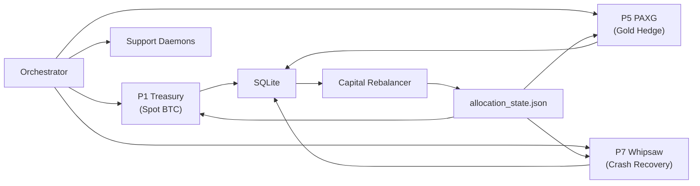

```
    ███████╗██╗███████╗███████╗███╗   ██╗
    ██╔════╝██║██╔════╝██╔════╝████╗  ██║
    █████╗  ██║███████╗█████╗  ██╔██╗ ██║
    ██╔══╝  ██║╚════██║██╔══╝  ██║╚██╗██║
    ███████╗██║███████║███████╗██║ ╚████║
    ╚══════╝╚═╝╚══════╝╚══════╝╚═╝  ╚═══╝
```

# EISEN — Algorithmic Trading System

A production BTC-USD trading system executing real orders on Coinbase since
March 2026. Three independent strategy engines run concurrently with a dynamic
capital allocator that shifts portfolio weights based on detected market regime.

**This is the public portfolio companion to a private production codebase.**
Architecture decisions, engineering methodology, and research frameworks are
documented here. Strategy parameters, signal logic, and raw backtest results
remain private.

Solo-engineered over 18 months. 408+ controlled experiments. 281+ hypotheses
tested. 104+ documented dead ends. 128 test modules.

---

## Why This Project Exists

I wanted to answer a question: can a single engineer build a trading system
that survives contact with real markets — not just backtests well, but actually
runs 24/7 placing real orders with real money?

The answer required solving three problems simultaneously:

1. **Strategy research** — finding signals that work after fees, across bull
   and bear regimes, validated out-of-sample
2. **Production engineering** — building infrastructure reliable enough to
   manage capital unsupervised: process supervision, crash recovery, staleness
   guards, position reconciliation
3. **Epistemic discipline** — knowing when a result is real vs. overfitted,
   when a strategy is dead vs. undertested, when to keep searching vs. accept
   structural limits

The interesting engineering isn't the trading logic. It's the system that
decides whether the trading logic is any good.

---

## Dashboard


*Custom Flask dashboard (~3,000 lines). Portfolio equity, regime detection,
per-pillar health, allocation history, equity curves, trade logs. Deployed on
VPS behind SSH tunnel with automated staleness kill switches.*

---

## Architecture

### Clean Architecture (Ports & Adapters)

Trading logic never imports concrete exchange code. The port/adapter boundary
means I can swap Coinbase for Binance, replace SQLite with Postgres, or run
the entire system in backtest mode without changing a single line of strategy
logic.

```
src/
├── domain/          # Pure Python models (Candle, OrderRequest, Signal)
├── ports/           # Abstract interfaces (ExecutionPort, MarketDataPort)
├── adapters/        # Exchange connectors (Coinbase REST/WS, CSV, SQLite)
├── services/        # Strategy engine, risk guards, regime detection
│   ├── adaptive_strategy_router.py    # Core router (~3,500 lines)
│   ├── router/                        # Extracted pure-function modules (14 files)
│   │   ├── bear_detection.py          # Multi-signal bear market detection
│   │   ├── crash_score.py             # 8-signal composite crash scorer
│   │   ├── regime_ensemble.py         # Lead-lag + BOCPD regime detection
│   │   ├── predictive_hold.py         # Predictive exit timing engine
│   │   ├── signal_generation.py       # Signal generation pipeline
│   │   ├── triple_barrier_gate.py     # ML sell-veto gate (HistGBT)
│   │   ├── portfolio_allocator.py     # CVaR-interpolated regime allocation
│   │   └── ...7 more modules
│   └── indicators/
│       └── technical_indicators.py    # Wilder-smoothed RSI/ATR, incremental Bollinger
├── backtesting/     # Walk-forward harness, BacktestEngine, Pareto search
└── config.py        # Pydantic-validated settings
```

See [architecture/port_interfaces.md](architecture/port_interfaces.md) for the
ABC definitions and [architecture/domain_models.md](architecture/domain_models.md)
for the pure domain layer.

### Multi-Pillar Portfolio

Each pillar is an independent process executing real Coinbase orders. One crash
doesn't take down the portfolio. If a required pillar fails unrecoverably, the
entire system halts — fail-safe, not fail-silent.



Capital allocation is dynamic and file-mediated. The allocator runs on a
separate loop using CVaR-interpolated weights with CHOP index dynamic shifting.
Each pillar reads its allocated capital percentage from a shared state file
and sizes orders proportionally. Staleness guard: if the allocation file is
older than 10 minutes, pillars refuse to trade.

All three pillars trade the same Coinbase account simultaneously. Position
conflicts are prevented by the allocation orchestrator, not by locking.

Full topology: [architecture/system_design.md](architecture/system_design.md)

### Versioning

A 4-namespace system prevents the most common confusion in multi-component
systems — conflating a component change with a system-level change:

| Namespace | Format | Example |
|-----------|--------|---------|
| System | `EISEN S{N}` | `EISEN S7` — full multi-pillar + allocator snapshot |
| Pillar | `P{N}-{Name}.v{M}` | `P1-Spot.v11` — individual pillar config |
| Allocator | `Alloc.v{M}` | `Alloc.v23` — allocation logic + regime tables |
| Deployment | `D{N}` | `D28` — VPS ops patch |

"Compare V10 to V11" is meaningless without scope. Is that a P1 config change?
A system-level change? An allocator update? The taxonomy forces precision.

---

## Subtractive Design

Most trading systems are built additively — keep adding indicators, strategies,
and complexity until the backtest looks good. EISEN does the opposite.

I built 9 strategy pillars. I systematically eliminated 6 of them with evidence.
Each elimination has a controlled test ID and P&L proof.

| Pillar | Strategy | Verdict | Evidence |
|--------|----------|---------|----------|
| P1 Treasury | Adaptive spot BTC, predictive hold/exit | **Kept** | V11 champion, Sortino 2.74 |
| P5 PAXG | Gold-backed crypto, regime diversification | **Kept** | Uncorrelated to BTC drawdowns |
| P7 Whipsaw | Crash recovery, staged re-entry | **Kept** | Best worst-case Sortino, +96.3 Sortino from ADX quality gate |
| P2 Hedge | Futures-hedged spot | Eliminated | -$183 cumulative, crash-loop instability on VPS |
| P3 Grid | Market-making grid | Eliminated | -$4,447 over 4yr — fee drag without maker rebates |
| P4 Multi-Token | Momentum alt rotation | Eliminated | Forward test -$3,884 (-38.85%), 80%+ backtest DD |
| P6 Weekend | Mean-reversion, low-volume windows | Eliminated | -$378 to -$696 cumulative, regime selection bias |
| P8 NLH | New listing detection | Eliminated | 154 crash-loop exits/day in production |
| P9 HF Verify | High-frequency signal verification | Eliminated | Zero gradient on all tested parameters |

The system got smaller over time, not larger. The winning config has 14
parameters. Early versions had 40+. The parameter count went down because the
dead parameters were identified and removed — 36+ confirmed zero-gradient
parameters across 408+ controlled tests.

---

## What I Learned Doesn't Work

This section exists because knowing what fails — and *why* — is more valuable
than knowing what works. These aren't hypotheticals; each is backed by
controlled experiments with locked evaluation contracts.

**Static thresholds beat every adaptive mechanism tested (0/9).** I tried
regime-conditional thresholds, vol-scaled thresholds, EMA-adaptive thresholds,
and ML-predicted thresholds. All nine variants performed worse than a fixed
lookup table. The intuition that "the market changes, so thresholds should
adapt" is appealing but wrong in practice — estimating the correct threshold
in real-time introduces more error than it removes in a noisy non-stationary
environment.

**Cooldowns are structural, not conservative.** My first instinct was that
cooldown periods were a crutch — overcautious behavior preventing optimal
entry timing. Removing them spiked drawdown from 27% to 77%+. They aren't
hesitation; they're load-bearing protection against whipsaw sequences that
would otherwise chain-trigger entries.

**Complexity is destructive.** Dynamic position sizing, regime-conditional
exits, monthly drawdown circuit breakers, vol-target sizing overlays — every
one either had zero measurable effect or actively degraded performance. The
failure mode is consistent: added estimation error exceeds the theoretical
benefit. This was the hardest lesson because the mechanisms are theoretically
sound.

**Market microstructure trumps indicators.** The EU Open (09:00-11:00 UTC) is
trend-dominant but violently noisy at short timeframes. Weekends are the only
safe mean-reversion window. The post-Jan 2025 regime quadrupled the BTC
Choppiness Index, requiring a CHOP < 61.8 entry gate — not a parameter tweak,
but a structural response to a market microstructure shift.

---

## Research Methodology

### Hypothesis-Driven Development

Every change starts as a numbered hypothesis (H1 through H309+):

```
PROPOSED -> ACTIVE -> {VALIDATED | REJECTED | DEAD_END}
```

Acceptance requires: a falsifiable prediction stated before testing, a
controlled test (CT-xxx) with a locked evaluation contract (metrics, windows,
fee model defined before the run), out-of-sample walk-forward validation, and
evidence of no degradation to other pillars.

The distinction between REJECTED and DEAD_END matters. Rejected means the
hypothesis didn't hold for the tested formulation. Dead End means the
underlying mechanism is structurally unviable — no reformulation will fix it.
Dead ends are indexed in a 104+ rule catalog so no future work re-explores
them.

### Tiered Testing

Running every configuration through the full evaluation suite is wasteful.
80% of candidates fail on the hardest single window. A phased protocol
eliminates duds early:

| Phase | What | Time/Config | Typical Kill Rate |
|-------|------|-------------|-------------------|
| Quick Kill | Hardest regime only | ~3 min | ~80% |
| Validation | 3-window eval contract | ~10 min | ~15% |
| Walk-Forward OOS | 6 yearly windows | ~25 min | Final gate |

A 20-config sweep takes ~25 min instead of ~7 hours. False negative risk is
low because Phase 1 tests on the hardest window for the hypothesis type
(bear window for bear-protection hypotheses, bull window for bull-capture).

Full framework: [methodology/parameter_testing.md](methodology/parameter_testing.md)

### Overfitting Detection

Three complementary techniques:

- **PBO** (Probability of Backtest Overfitting) — combinatorial symmetric
  cross-validation across time windows
- **Deflated Sharpe** — adjusts for the multiple-testing problem when running
  hundreds of configurations
- **IS-to-OOS decay tracking** — flags configurations where in-sample
  performance degrades out-of-sample beyond expected variance

### Adversarial Red-Teaming

Every hypothesis passes four stress tests before acceptance:

1. **Forward-bias check** — can the signal execute on the next bar, or does
   it require future information?
2. **Hostile regime survival** — does it survive 2022-type bears, not just
   2023-type bulls?
3. **Mechanism explainability** — can the mechanism be explained? If not,
   it's curve-fitting regardless of backtest performance.
4. **Pluribus test** — does the edge survive if many participants run the
   same strategy?

After every factorial campaign (testing parameter combinations), a temporal
red-team pass checks for regime-specific overfitting.

Framework: [methodology/adversarial_reasoning.md](methodology/adversarial_reasoning.md)

---

## AI-Augmented Development

EISEN is built with a structured multi-agent AI harness where different
personas activate for different tasks. The key design insight: a single
AI perspective misses the same things a single human perspective misses.
Structured disagreement between personas catches errors that uniform
workflows don't.

| Persona | Role | Acceptance Criteria |
|---------|------|-------------------|
| Orchestrator | Architecture, task decomposition | Structural coherence |
| Researcher | Experiment design, statistical validity | Falsifiable predictions |
| Executor | Implementation with minimal side effects | Clean diffs, no scope creep |
| Validator | OOS proof demands | Quantified evidence only |
| Adversary | Red-teaming, overfitting detection | Survives hostile regimes |
| Entropy Architect | Fragility analysis | Breaks under which conditions? |

The Adversary rejects hypotheses the Researcher proposed. The Validator
demands evidence the Executor didn't generate. This isn't bureaucracy — it's
the same principle as code review, applied to research methodology.

14 automated post-edit hooks fire on every code change (import integrity,
config validation, pillar lockstep checks). 21 reusable skill workflows
handle recurring operations.

Protocol: [engineering/agent_coordination.md](engineering/agent_coordination.md)

---

## Live Execution

The system runs on a VPS (Windows Server 2025) as supervised services,
with all three pillars placing real market orders on Coinbase Advanced Trade.

Key production engineering decisions:

- **Quote-size BUY orders**: Market BUY orders specify the USD amount to spend
  (`quote_size`) rather than asset quantity (`base_size`). This avoids
  `INVALID_SIZE_PRECISION` errors across products with different lot sizes and
  lets Coinbase fill at the best available price. Learned by failing in
  production, not in backtest.
- **Historical prewarm**: On restart, the router feeds 500 historical candles
  through the indicator pipeline so regime detectors, crash scorers, and
  EMA buffers are warm immediately. No 50-hour cold-start waiting for
  observation buffers to fill.
- **Deposit-adjusted equity**: Capital flows (deposits, withdrawals) are
  tracked as first-class events. PnL is computed against
  `capital_base = seed + net_flows`, not raw account equity. Without this,
  a deposit looks like a profit.
- **Staleness kill switches**: Every data source has a maximum age. Stale
  allocation state (>10 min), stale candle data, stale feature data — all
  trigger defensive behavior (reduced sizing or trade refusal), not silent
  continuation with outdated information.
- **Fail-safe orchestration**: If a required pillar enters an unrecoverable
  crash loop, the entire orchestrator halts. Optional pillars fail
  independently. This is a deliberate choice — partial portfolio execution
  with unknown allocation drift is worse than a clean shutdown.

See [engineering/capital_event_tracking.md](engineering/capital_event_tracking.md)
and [engineering/live_execution.md](engineering/live_execution.md).

---

## Structural Limits

Constraints I've identified that cannot be fixed without fundamental
architecture changes. These define the system's domain, not its defects.

- **Long-only**: Cannot profit during prolonged bear markets (2022-type).
  The system's bear-market strategy is capital preservation, not shorting.
- **Max DD floor ~27.55%**: Hard limit without shorting capability.
  Represents the cost of staying long-only.
- **Parameter space deeply explored**: 408+ controlled tests with
  diminishing marginal returns on further optimization.
- **Static threshold ceiling**: 0/9 dynamic variants improved on static
  thresholds. The estimation error of adaptive mechanisms exceeds their
  theoretical benefit.
- **Fee asymmetry**: Grid and market-making strategies are structurally
  unprofitable on Coinbase's fee schedule without maker rebates.

---

## Performance Context

The system has been live-trading with real capital on Coinbase since March
2026 (VIP 8 fee tier: 0.020% taker, 0.000% maker). Figures below are from
backtested simulations using walk-forward out-of-sample validation prior
to live deployment. Past performance does not guarantee future results. The
system is structurally long-only and cannot profit during prolonged bear
markets.


V11 Champion (P1-Spot.v11), full 4-year backtest (2022-2025):

| Metric | Value |
|--------|-------|
| Sortino (gamma=2) | 2.736 |
| Calmar | 1.661 |
| Max Drawdown | 27.55% |
| Total Trades | 87 (~2/month) |

Why Sortino over Sharpe: Sharpe penalizes all volatility equally. In crypto,
upside moves are structurally larger than downside. Penalizing a +15% day the
same as a -15% day is mathematically inappropriate for right-skewed return
distributions. Sortino with gamma=2 penalizes only downside deviation, which
is what actually represents risk.

---

## Stack

| Component | Technology |
|-----------|-----------|
| Language | Python 3.11+ |
| Exchange | Coinbase Advanced Trade (REST + WebSocket) |
| Execution | Live market orders (BTC-USDC, PAXG-USDC) |
| Database | SQLite (WAL mode) |
| Config | Pydantic + JSON presets |
| Data Pipeline | 6 APIs, 25 features/cycle, 220K+ feature rows |
| ML | HistGBT triple-barrier classifier (sell-veto gate) |
| WebSockets | L2 orderbook, strict TLS (certifi CA bundle) |
| Backtesting | Walk-forward, Pareto search, PBO detection |
| Deployment | VPS (Windows Server 2025), NSSM services |
| Monitoring | Custom Flask dashboard (~3K lines) + SSH tunnel |
| Quality | ruff, mypy, pytest (128 modules) |

---

## This Repository

```
eisen-portfolio/
├── README.md
├── docs/                              # Screenshots and benchmark charts
├── architecture/
│   ├── port_interfaces.md             # Clean Architecture ABCs
│   ├── domain_models.md               # Pydantic data contracts
│   └── system_design.md               # Multi-pillar topology
├── methodology/
│   ├── parameter_testing.md           # Tiered hypothesis validation
│   └── adversarial_reasoning.md       # Game-theoretic signal evaluation
└── engineering/
    ├── engineering_standards.md        # Code style, anti-patterns
    ├── validation_matrix.md           # What to validate and when
    ├── agent_coordination.md          # Multi-persona AI development
    ├── capital_event_tracking.md      # Deposit-aware equity tracking
    └── live_execution.md              # Live trading architecture
```

The full production codebase (137 scripts, 128 test modules, 21 skill
workflows, 50+ forensics reports, 281+ hypotheses, 408+ controlled tests)
is in a private repository.

---

## About

Built by [Raymond de Oliveira](https://github.com/raydeoliveira).

18+ months of continuous development — designing, building, testing, and
operating a production trading system from first principles. The methodology
(hypothesis-driven development, tiered testing, adversarial red-teaming,
subtractive design, systematic dead-end tracking) transfers to any domain
where decisions must be evidence-based and failures must become institutional
knowledge.
