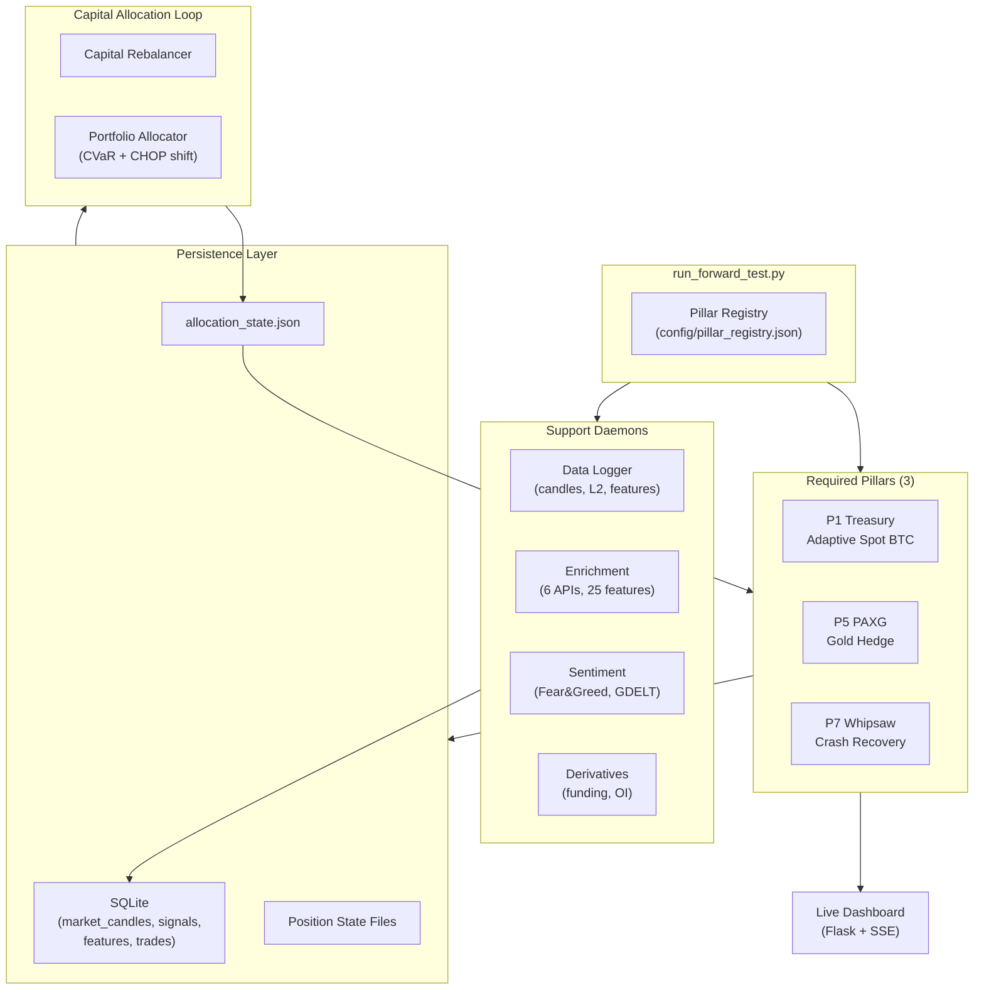

# System Design — Multi-Pillar Architecture

## Overview

EISEN is not a single trading strategy — it's a **portfolio orchestration system** that runs multiple independent strategy engines ("pillars") with dynamic capital allocation.

## Runtime Topology



## Failure Policy

- **Required pillar crash**: Fatal orchestrator shutdown. No partial operation.
- **Support daemon crash**: Graceful degradation. Data goes stale, features age, but trading continues with cached state.
- **Allocation staleness**: If `allocation_state.json` is older than 10 minutes, pillars fall back to default weights.
- **WebSocket disconnect**: Exponential backoff reconnection. REST fallback for critical data.

## Capital Allocation

The allocator is **not static**. It uses regime-conditional tables:

| Regime | P1 Treasury | P5 PAXG | P7 Whipsaw |
|--------|-------------|---------|------------|
| Bull | Higher spot exposure | Minimal gold | Moderate recovery |
| Bear | Reduced spot | Higher gold | Higher recovery |
| Neutral | Balanced | Moderate gold | Moderate recovery |

Allocation shifts are driven by:
- **CVaR interpolation**: Conditional Value at Risk across regime states
- **CHOP index shifting**: Choppiness-driven rebalancing
- **P7 cap**: Whipsaw pillar capped at 60% to prevent concentration risk
- **Event overrides**: Calendar-gated adjustments for known macro events (FOMC, NFP, CPI, OPEX, etc.)
- **IDLE event overrides (Alloc.v23)**: 8 macro-event overrides for the IDLE regime, redirecting capital during scheduled volatility windows
- **Idle-realloc (H308)**: When P7 is dormant for 6+ bars, 65% of its capital redirects to PAXG safe-haven

## Versioning

The system uses a 4-namespace taxonomy to prevent version ambiguity:

```
EISEN S7           ← Full system state (all pillars + allocator)
├── P1-Spot.v11    ← Individual pillar config
├── P5-PAXG.v1     ← Individual pillar config
├── P7-Whipsaw.v5  ← Individual pillar config
├── Alloc.v23      ← Allocator logic version
└── D28            ← Deployment patch (ops only)
```

### Anti-Pattern

> "Compare V10 to V11" — **NEVER acceptable without scope**
>
> ✅ `P1-Spot.v10` vs `P1-Spot.v11` (pillar scope)
> ✅ `EISEN S6` vs `EISEN S7` (system scope)
> ❌ "V10 vs V11" (ambiguous — could mean either)

## System Evolution (S1 → S7)

| Version | Key Change | Pillars |
|---------|-----------|---------|
| S1–S3 | Additive exploration | 9 active pillars |
| S4 | P2 eliminated (CT-361), P6 zeroed | 7 funded |
| S5 | Topology reduced to 3 funded + 6 runners | 3 funded |
| S6 | Optional pillars demoted from required | 3 required + 6 optional |
| **S7** | **P4 eliminated, 6 pillars disabled entirely** | **3 required only** |

Each transition has a controlled test ID and evidence trail. System state snapshots can be generated, saved, and diffed programmatically.

## Data Pipeline

```
Live Sources → SQLite → Router Features
  ├── Coinbase WS → 1m candles + L2 microstructure
  ├── Fear & Greed API → daily sentiment index
  ├── GDELT → news volume, news tone
  ├── Enrichment (6 APIs) → 25 features/cycle
  ├── Derivatives → funding rates, open interest
  └── MCP adapters → LunarCrush social, Deribit options
```

The pipeline writes to SQLite tables with UTC timestamps. Features are stored in `live_features_log` (106 distinct features, 220K+ rows). The router reads features with configurable staleness budgets — if a feature is too old, it's excluded rather than used stale.
